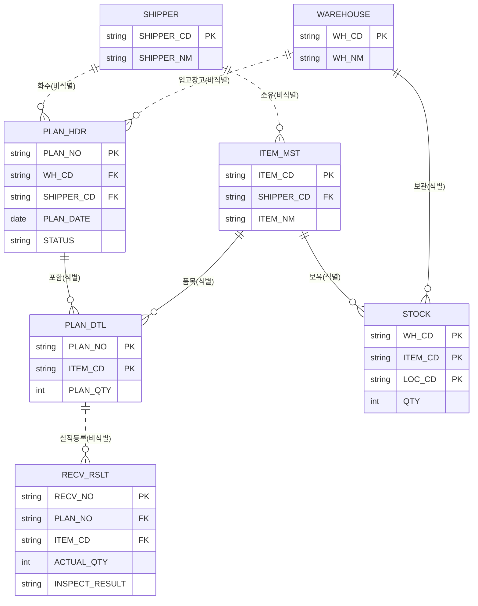

# 3PL 입고 미니 프로젝트

## 프로젝트 개요
- 개인 학습용 WMS 미니 프로젝트
- 시작 범위: 입고(Inbound) 모듈 → 이후 재고관리/출고로 확장
- 창고(Warehouse) + 화주(Shipper) 개념을 포함한 3PL형 구조
- 기술 스택
  - 프론트엔드: Vue.js (Quasar Framework)
  - 백엔드: Spring Boot
  - DB/매퍼: MariaDB + MyBatis

## 프로젝트 구조
```
wms-mini-project/
├── README.md
├── docker/
│   └── docker-compose.yml
├── ddl/
│   └── 01_shipper_warehouse.sql
├── backend/                  # Spring Boot + MyBatis
│   ├── pom.xml
│   └── src/main/
│       ├── java/com/wms/mini/
│       │   ├── WmsMiniApplication.java
│       │   ├── config/WebConfig.java        # CORS 설정
│       │   ├── domain/                      # Shipper, Warehouse
│       │   ├── mapper/                      # MyBatis 인터페이스
│       │   ├── service/
│       │   └── controller/                  # REST API
│       └── resources/
│           ├── application.yml
│           └── mapper/                      # MyBatis XML
└── frontend/                 # Vue3 + Quasar
    ├── package.json
    ├── quasar.config.js
    ├── index.html
    └── src/
        ├── boot/axios.js                    # baseURL: localhost:8080
        ├── router/
        ├── layouts/MainLayout.vue
        └── pages/
            ├── IndexPage.vue
            ├── ShipperPage.vue               # 화주 CRUD 화면
            └── WarehousePage.vue             # 창고 CRUD 화면
```

## 로컬 개발 환경 실행

### 1. DB 컨테이너 실행
```bash
cd docker
docker compose up -d
```
`wms_mini` 데이터베이스가 포함된 MariaDB 컨테이너(`my-mariadb`)가 자동으로 뜹니다.

### 2. 테이블 생성
```bash
docker exec -it my-mariadb mariadb -u root -p1234 wms_mini
```
접속 후 `ddl/01_shipper_warehouse.sql`의 내용을 실행합니다.

### 3. 백엔드 실행
```bash
cd backend
mvn spring-boot:run
```
`http://localhost:8080/api/shippers`, `/api/warehouses`로 접속 확인 가능. (IntelliJ에서 Maven 프로젝트로 열어서 실행해도 무방)

### 4. 프론트엔드 실행
```bash
cd frontend
npm install
npm run dev
```
`http://localhost:9000`에서 화면 확인. 화주/창고 관리 메뉴에서 등록·수정·삭제(CRUD) 테스트 가능.

> 백엔드(8080)와 프론트(9000) 포트가 다르므로 `WebConfig.java`에서 CORS를 허용해뒀습니다.

## 물류 전체 흐름 (참고)
- 입고: 예정등록 → 입하 → 검수 → 입고확정 → 적치
- 보관&재고관리: 조회 → 재고실사 or 재고이동 → 재고조정
- 출고: 지시 → 할당 → 피킹리스트 → 피킹 → 검품 → 포장 → 상차 → 출하확정

## 입고 프로세스 흐름도
```
예정등록 → 입하 → 검수 → 입고확정 → 적치
```

## 핵심 설계 원칙
1. **계획과 실행결과 분리**: 입고예정디테일(계획)과 입고실적(실행결과)은 의미가 다르므로 별도 테이블로 관리.
2. **재고는 입고확정 시점에만 갱신**: 입하/검수 단계에서는 재고를 건드리지 않음.
3. **화주 정보는 중복 저장하지 않음(정규화)**: STOCK에는 화주 컬럼을 직접 넣지 않고 ITEM_MST를 통해 간접 참조.
4. **식별관계 / 비식별관계 구분**: 자식 테이블 PK가 부모 PK를 포함하는지에 따라 관계선 구분.

## 테이블 설계

| 테이블 | 한글명 | PK | 주요 FK |
|---|---|---|---|
| `SHIPPER` | 화주마스터 | SHIPPER_CD | - |
| `WAREHOUSE` | 창고마스터 | WH_CD | - |
| `ITEM_MST` | 품목마스터 | ITEM_CD | SHIPPER_CD |
| `PLAN_HDR` | 입고예정마스터 | PLAN_NO | WH_CD, SHIPPER_CD |
| `PLAN_DTL` | 입고예정디테일 | (PLAN_NO+ITEM_CD) | PLAN_NO, ITEM_CD |
| `RECV_RSLT` | 입고실적 | RECV_NO | PLAN_NO, ITEM_CD |
| `STOCK` | 재고(재고마스터) | (WH_CD+ITEM_CD+LOC_CD) | WH_CD, ITEM_CD |

### 관계 요약
- 화주 1 : N 품목 (비식별)
- 화주 1 : N 입고예정마스터 (비식별)
- 창고 1 : N 입고예정마스터 (비식별)
- 입고예정마스터 1 : N 입고예정디테일 (식별)
- 품목 1 : N 입고예정디테일 (식별)
- 입고예정디테일 1 : N 입고실적 (비식별)
- 품목 1 : N 재고 (식별)
- 창고 1 : N 재고 (식별)

## ERD (Mermaid)


## 진행 순서 (착수 계획)
1. **화주(SHIPPER) / 창고(WAREHOUSE) 마스터** ← 현재 단계 (FK 없는 독립 테이블, end-to-end 워밍업)
2. 품목마스터(ITEM_MST) — SHIPPER FK 참조
3. 입고예정마스터/디테일(PLAN_HDR/PLAN_DTL) — 헤더-디테일 화면 패턴
4. 입고실적(RECV_RSLT) → 재고(STOCK) 반영 — 핵심 트랜잭션 로직
